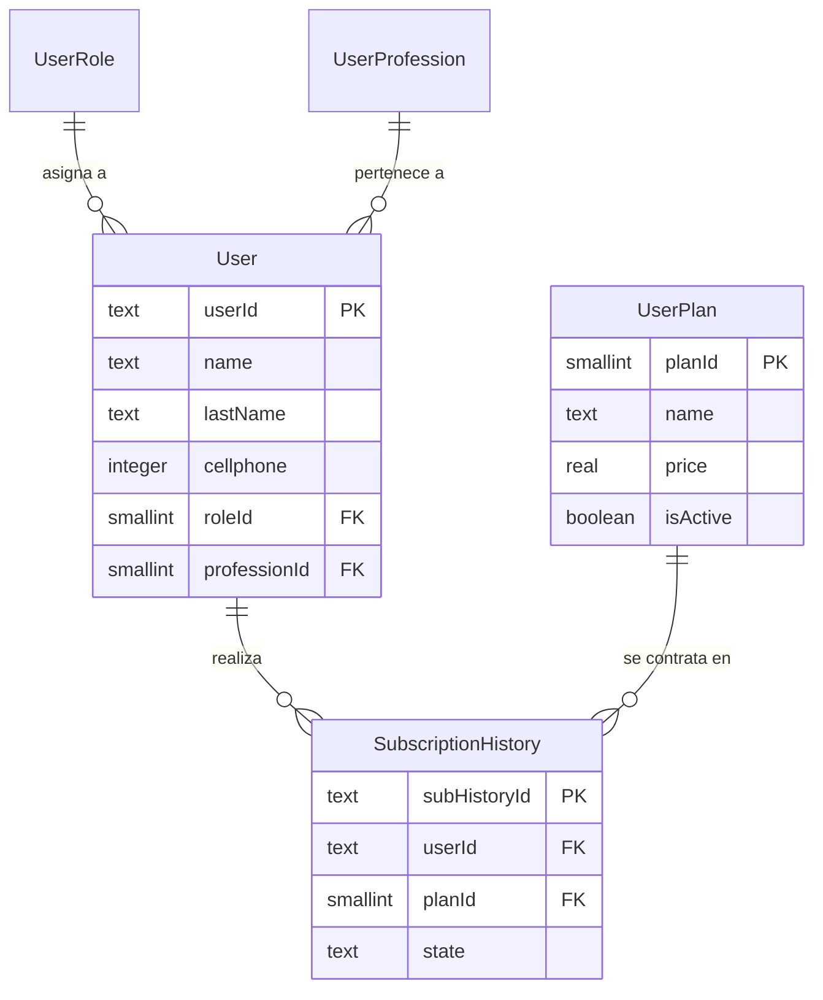

# Especificación: Gestión de Usuarios y Suscripciones

Este módulo define la estructura para el registro extendido de usuarios, el control de roles, profesiones y el sistema de monetización mediante planes y suscripciones.

## 1. Arquitectura de Tablas

### Módulo de Identidad Base
- **UserRole**: Define los permisos y niveles de acceso en la aplicación (ej: Administrador, Editor, Lector).
- **UserProfession**: Catálogo de profesiones para segmentar a los usuarios (ej: Ingeniero Civil, Arquitecto, Contratista).
- **User**: La tabla central que une la identidad de Supabase Auth con los datos de perfil, rol y profesión.

### Módulo de Negocio (Suscripciones)
- **UserPlan**: Catálogo de ofertas comerciales. Incluye lógica de precios, descuentos temporales y duración del plan.
- **SubscriptionHistory**: Registro histórico de todas las transacciones y estados de suscripción de un usuario. Permite auditoría de ingresos y control de acceso por tiempo.

---

## 2. Diagrama de Relaciones (Mermaid)

---

## 3. Detalle de Columnas y Reglas

### Módulo de Perfil
| Tabla | Columna | Tipo | Regla |
| :--- | :--- | :--- | :--- |
| **User** | `userId` | Text | Debe ser el UUID proveniente de `auth.users`. |
| **User** | `roleId` | Smallint | FK obligatoria. Protegida con `RESTRICT` en eliminación. |
| **UserProfession** | `name` | Text | Valor único para evitar duplicados en el catálogo. |

### Módulo de Suscripción
- **UserPlan (`discountPrice`)**: Si está presente, debe validarse contra `discountStartDate` y `discountEndDate`.
- **SubscriptionHistory (`state`)**: Define si la suscripción está `ACTIVE`, `EXPIRED`, `CANCELLED` o `PENDING`.
- **Precios**: Se utiliza el tipo `real` para optimizar el almacenamiento de valores monetarios en la base de datos distribuida.

---

## 4. Consideraciones de Implementación en Android
1.  **Sincronización:** Al registrar un usuario en Supabase Auth, se debe disparar un proceso (o función) que inserte el registro correspondiente en la tabla `public.User`.
2.  **Room (Local):** Se recomienda cachear las tablas `UserRole` y `UserProfession` ya que son catálogos que cambian poco y agilizan el formulario de registro.
3.  **Seguridad (RLS):** La tabla `User` debe tener políticas de Row Level Security donde `uid() == userId` para que los usuarios solo puedan editar su propio perfil.
